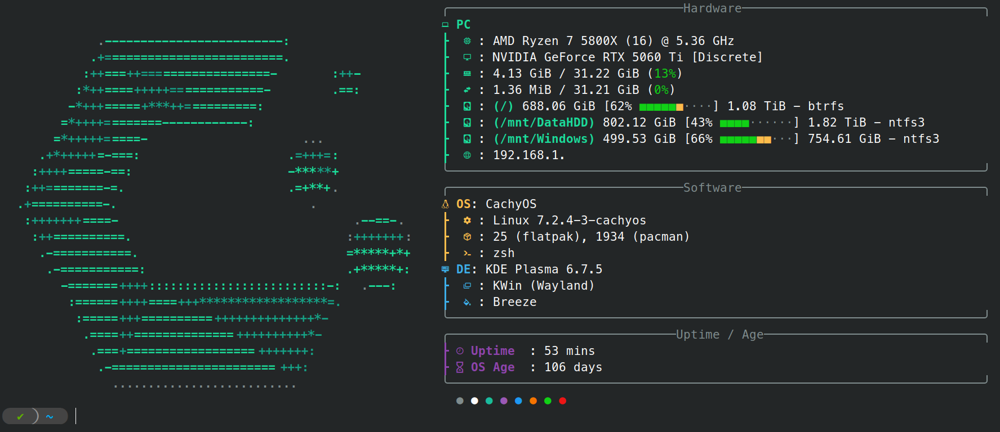

# myzsh


## Introduction
This repository contains my personal Zsh configuration.

It is heavily customized around my own workflow, preferences, aliases, functions, keybindings, and development environment. It was never designed to be a general-purpose configuration or a framework for others to use directly.

The main purpose of publishing it is to:
- Keep a version-controlled backup.
- Make it easy to synchronize across my machines.
- Share ideas that others may find useful.

If you decide to use parts of this configuration, expect to modify it to suit your own environment.

## Dependencies
Dependig on what features you decide to add you may need some of the following dependencies, for the full setup you will need:
    
- Zsh
- Oh My Zsh
    - zsh-autosuggestions
    - zsh-syntax-highlighting
- powerlevel10k
- Zoxide
- fzf
- fastfetch
- Distrobox
- Any nerd font, see [here](https://www.nerdfonts.com/font-downloads).

## Installation
<details>

<summary><strong>Oh My Zsh</strong></summary>

```sh
sh -c "$(curl -fsSL https://raw.githubusercontent.com/ohmyzsh/ohmyzsh/master/tools/install.sh)"
```

</details>

<details>

<summary><strong>zsh-autosuggestions</strong></summary>

```sh
git clone https://github.com/zsh-users/zsh-autosuggestions.git "${ZSH_CUSTOM:-$HOME/.oh-my-zsh/custom}/plugins/zsh-autosuggestions"
```

</details>

<details>

<summary><strong>zsh-syntax-highlighting</strong></summary>

```sh
git clone https://github.com/zsh-users/zsh-syntax-highlighting.git "${ZSH_CUSTOM:-$HOME/.oh-my-zsh/custom}/plugins/zsh-syntax-highlighting"
```

</details>

</details>

<details>

<summary><strong>powerlevel10k</strong></summary>

Install powerlevel10k:

```sh
 git clone --depth=1 https://github.com/romkatv/powerlevel10k.git ~/.powerlevel10k
```
Install my config:

Copy the `.p10k.zsh` file in the repo to `~/.p10k.zsh`:

```
 [ -f "$HOME/.p10k.zsh" ] && mv "$HOME/.p10k.zsh" "$HOME/.p10k.zsh.backup"
 curl -Lf "https://raw.githubusercontent.com/Scratchaker/myzsh/main/.p10k.zsh" -o "$HOME/.p10k.zsh"
```

</details>

<details>

<summary><strong>Shell Profile</strong></summary>

Download the repo as a ZIP, extract every `.sh` file somewhere in your home folder, and append the following to your `~/.zshrc`, replacing `$HOME/path/to/extracted/files` with the path where you extracted the files.

```sh
SCRIPTS_PATH="$HOME/path/to/extracted/files"
for script in "$SCRIPTS_PATH"/*.sh; do
    [ -f "$script" ] && . "$script"
done
unset script
```
<details>
    <summary>Or automatically:</summary>

```
 [ -d "$HOME/.zshrc.d" ] && mv "$HOME/.zshrc.d" "$HOME/.zshrc.d.backup"
 mkdir -p "$HOME/.zshrc.d"

 curl -Lf "https://raw.githubusercontent.com/Scratchaker/myzsh/main/01-OMZconfig.sh" -o "$HOME/.zshrc.d/01-OMZconfig.sh"
 curl -Lf "https://raw.githubusercontent.com/Scratchaker/myzsh/main/02-env.sh" -o "$HOME/.zshrc.d/02-env.sh"
 curl -Lf "https://raw.githubusercontent.com/Scratchaker/myzsh/main/03-exports.sh" -o "$HOME/.zshrc.d/03-exports.sh"
 curl -Lf "https://raw.githubusercontent.com/Scratchaker/myzsh/main/04-evals.sh" -o "$HOME/.zshrc.d/04-evals.sh"
 curl -Lf "https://raw.githubusercontent.com/Scratchaker/myzsh/main/05-aliases.sh" -o "$HOME/.zshrc.d/05-aliases.sh"
 curl -Lf "https://raw.githubusercontent.com/Scratchaker/myzsh/main/06-functions.sh" -o "$HOME/.zshrc.d/06-functions.sh"
 curl -Lf "https://raw.githubusercontent.com/Scratchaker/myzsh/main/07-path.sh" -o "$HOME/.zshrc.d/07-path.sh"
 curl -Lf "https://raw.githubusercontent.com/Scratchaker/myzsh/main/08-prompt.sh" -o "$HOME/.zshrc.d/08-prompt.sh"
 curl -Lf "https://raw.githubusercontent.com/Scratchaker/myzsh/main/09-toolsconfig.sh" -o "$HOME/.zshrc.d/09-toolsconfig.sh"
 curl -Lf "https://raw.githubusercontent.com/Scratchaker/myzsh/main/10-startup.sh" -o "$HOME/.zshrc.d/10-startup.sh"
 curl -Lf "https://raw.githubusercontent.com/Scratchaker/myzsh/main/11-distrobox.sh" -o "$HOME/.zshrc.d/11-distrobox.sh"
 curl -Lf "https://raw.githubusercontent.com/Scratchaker/myzsh/main/12-end.sh" -o "$HOME/.zshrc.d/12-end.sh"

 cat << 'EOF' >> "$HOME/.zshrc"

# Scratchaker/myzsh
SCRIPTS_PATH="$HOME/.zshrc.d"
for script in "$SCRIPTS_PATH"/*.sh; do
    [ -f "$script" ] && . "$script"
done
unset script
EOF
```
    
</details>

</details>

<details>

<summary><strong>Fastfetch config</strong></summary>

Copy the `.config/fastfetch/config.jsonc` file in the repo to `~/.config/fastfetch/config.jsonc`:

```
 [ -f "$HOME/.config/fastfetch/config.jsonc" ] && mv "$HOME/.config/fastfetch/config.jsonc" "$HOME/.config/fastfetch/config.jsonc.backup"
 mkdir -p "$HOME/.config"
 curl -Lf "https://raw.githubusercontent.com/Scratchaker/myzsh/main/.config/fastfetch/config.jsonc" -o "$HOME/.config/fastfetch/config.jsonc"
```

</details>
